# ClubMate UI

ClubMate is a minimalist chat app for university clubs. The UI is built with Jetpack Compose and
Material 3. It follows the phone's light or dark setting.

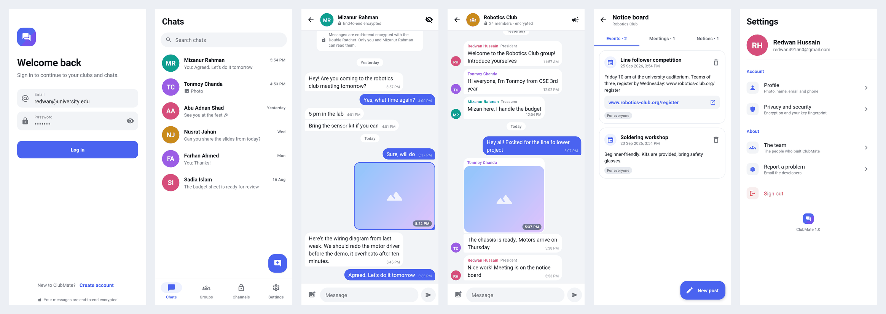

## Design principles

- **Content first.** Screens use white or near-black surfaces, one accent colour (indigo `#4A63F0`)
  and hairline dividers instead of cards and shadows.
- **One look everywhere.** Every screen is built from the same small set of components in
  `ui/components`.
- **Privacy is visible.** Chats say "End-to-end encrypted" under the name, and each conversation opens
  with a short encryption note. Incognito chats and private channels switch to a dark "private" style.
- **No dead ends.** Empty lists explain what to do next, and destructive actions ask for confirmation.
  Errors appear inline (forms) or as a toast (background actions).

## Design system (`ui/theme`)

| File | What it defines |
|---|---|
| `Color.kt` | `Palette` (indigo accent, grey and night scales, red, green) and 8 avatar colours. |
| `Theme.kt` | Light and dark Material 3 colour schemes, plus `ClubMateTheme.chat` colours for bubbles, day pills and incognito. |
| `Type.kt` | Type scale: headline sizes for tab titles, body 16 sp for messages, 11 sp for message times. |
| `Shape.kt` | Corner radii 6, 10, 14, 20 and 28 dp. |

## Components (`ui/components`)

| Component | Used for |
|---|---|
| `Avatar` | Profile photo, or coloured initials (the colour is fixed per name), or an icon for groups. |
| `AppTopBar`, `TabHeader` | Screen top bar with back, avatar, subtitle and actions; large title on home tabs. |
| `AppTextField`, `SearchField` | Filled text fields without underline; password toggle; pill-shaped search. |
| `PrimaryButton`, `SecondaryButton`, `LinkButton` | Full-width actions with a loading state. |
| `ListRow`, `SettingsRow`, `InfoRow`, `SectionHeader` | Lists of chats, members and settings; copyable details. |
| `EmptyState`, `ConfirmDialog`, `InlineError`, `OfflineBanner`, `Pill` | Feedback. |
| `MessageList`, `MessageBubble`, `MessageComposer` | The chat UI (below). |
| `BrandMark` | App mark on sign-in, splash and settings. |

### Chat UI (`ui/components/Chat.kt`)

- Messages are grouped into **runs**: consecutive messages from the same sender within 5 minutes
  share one bubble shape, so only the last bubble of a run has a tail.
- **Day separators** ("Today", "Yesterday", weekday or date) float as pills between days.
- The **time sits inside the bubble**. It goes on the last line of the text when it fits, otherwise
  on its own line (a custom `Layout`).
- In groups, the sender's name (in their avatar colour) and role appear at the top of each run, and
  their avatar at the bottom.
- **Photos** fill the bubble and show the time on a dark chip. They are decrypted on the device by
  `SecureAsyncImage`.
- **Long-press** a message to copy it or, for your own messages, delete it for everyone.
- The list is reversed (newest at the bottom). It follows new messages only while you're at the bottom.
- The composer is a pill-shaped field with an attach button and a send button. A picked photo shows as
  a removable preview above it.

## Screens

| Area | Screens (package `ui/…`) |
|---|---|
| Sign in | Splash, Log in, Create account (`auth`) |
| Home | Bottom navigation with **Chats**, **Groups**, **Channels** and **Settings**. Search and an "offline" banner on the lists. The **New chat** sheet finds people by email or username. The **Groups** sheet creates a group, or finds one by ID and sends a join request. (`home`) |
| 1:1 chat | Chat with incognito mode (a dark style whose messages are deleted when you leave), and contact info with the **safety number**, copy buttons, "Delete my messages" and "Delete chat". (`chat`) |
| Groups | Group chat. Group info: invite ID, members preview, notice board, admin console, leave. Members list (grouped into admins/committee and members, with search). Member page: admins change roles or remove. Create group (generated ID). Add member (by email, with role). Admin console: group photo, stats, join requests with approve/decline, and manage actions. Notice board (Events, Meetings, Notices; links become buttons). New post (type, title, body, audience). (`group`) |
| Private channels | Join (channel ID and password, using the signed-in account), create (generated ID; password of 8+ characters), and a channel chat with vanishing messages. Senders get stable pseudonyms such as "Blue Otter", because channels have no member list. (`channel`) |
| Settings | Profile (photo upload, copyable details), Privacy and security (how the encryption works, plus your key fingerprint), The team, Report a problem (opens an email), Sign out. (`settings`) |

All screens and their connections are in `ui/AppNavHost.kt`, using type-safe Navigation Compose
routes (`db/data.kt`). The screens slide in from the right and fade.

### Screenshots

| | | | |
|---|---|---|---|
| 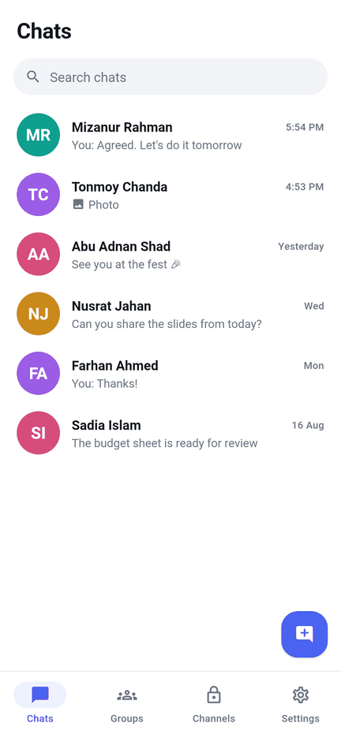 | 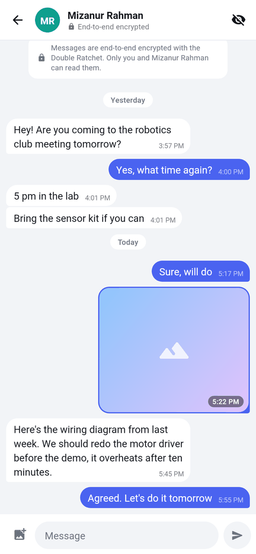 | 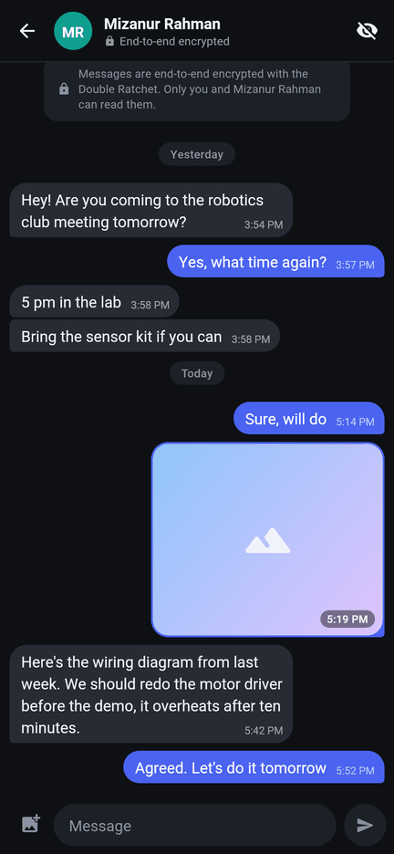 | 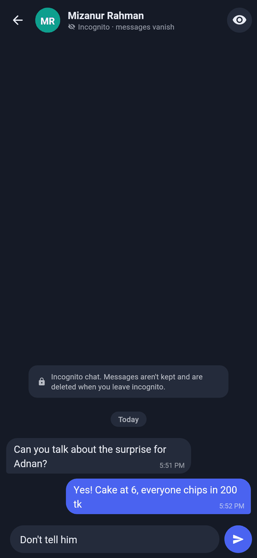 |
| 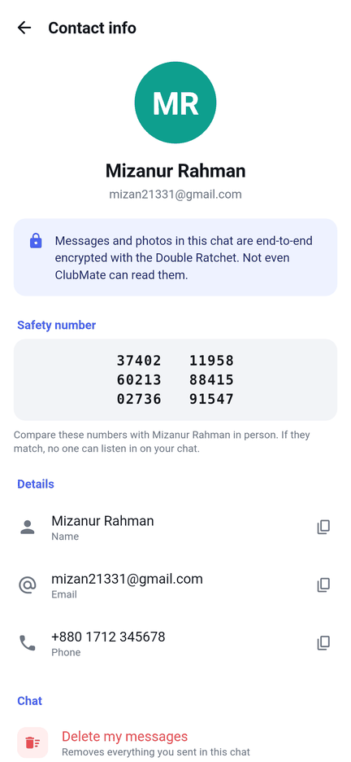 | 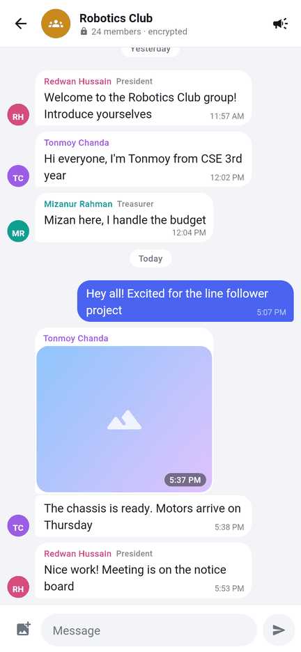 | 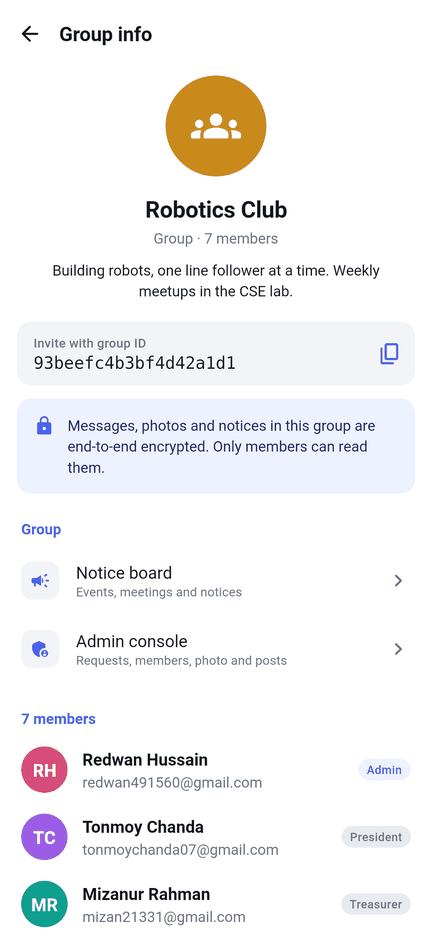 | 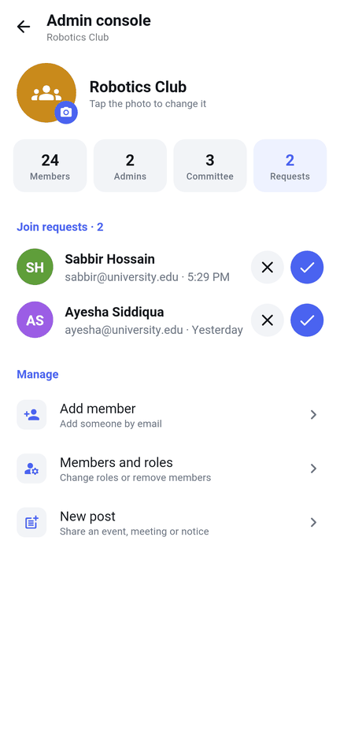 |
| 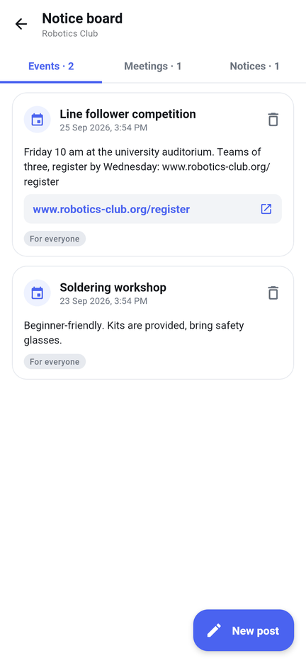 | 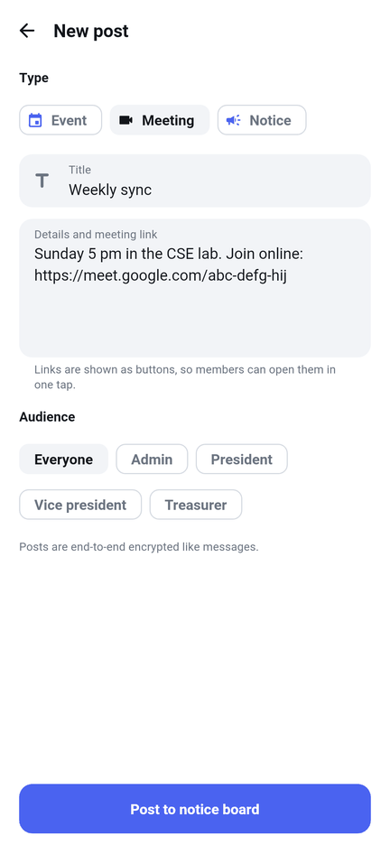 | 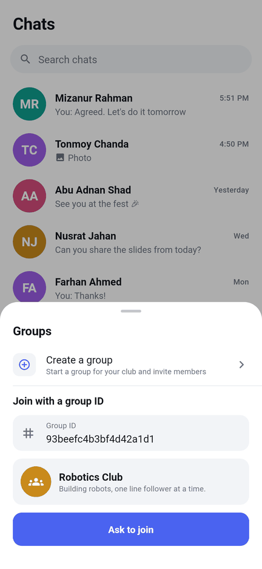 | 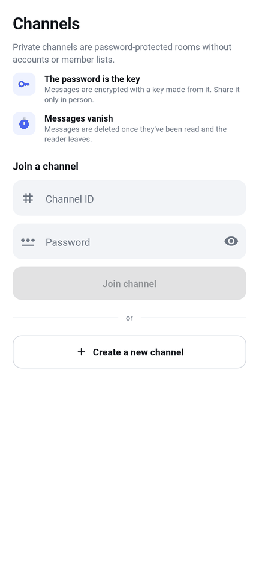 |
| 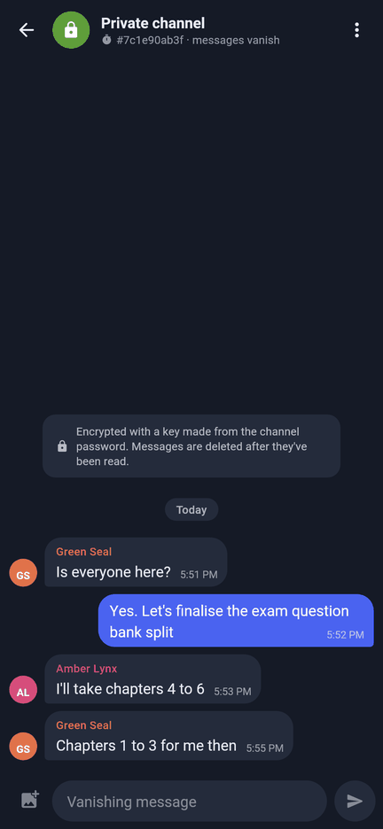 | 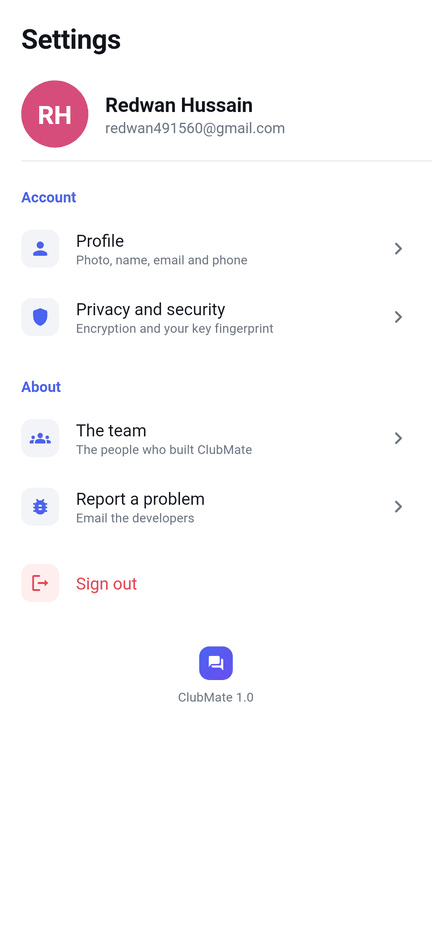 | 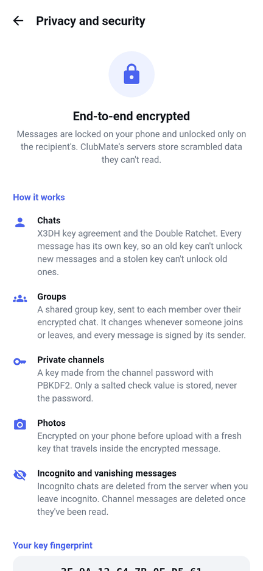 | 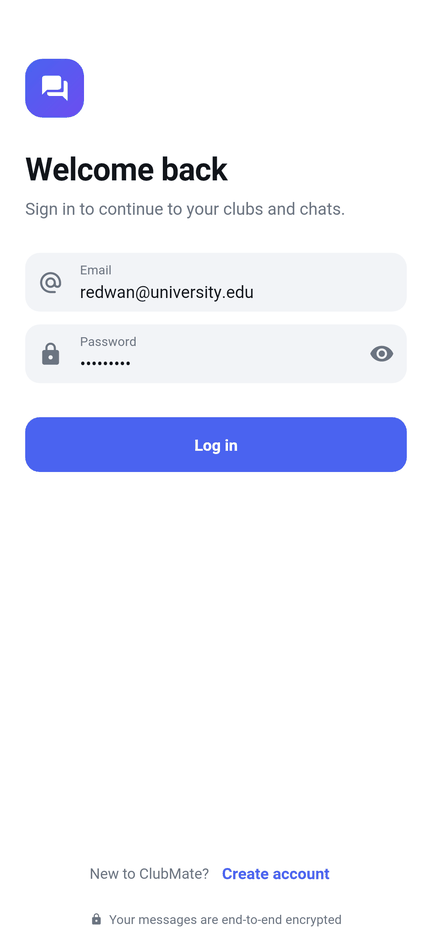 |

The screenshots are rendered from the `@Preview` functions with sample data. Emoji show in
monochrome because of the renderer used.

## How screens are written

Each screen has two parts:

- **`XxxScreen(...)`** is stateless: it gets plain data and callbacks. It has a `@Preview` with
  sample data, so it can be designed and checked without Firebase.
- **`XxxRoute(...)`** connects the screen to the view models: it collects state, starts and stops
  listeners, launches the photo picker, and shows confirmations and toasts.

The view models are unchanged in role; they still send only encrypted data. Small fixes made for
the new UI:
- `addParticipants` and `removeParticipants` now report success, so the UI can say if an email has
  no account.
- The participant and join-request listeners are no longer added again every time a screen opens.
- The chat and group view models are created per signed-in account. Chats now appear right after
  signing in, without restarting the app.

## What changed from the old UI

- Kept: every working feature (chats, images, incognito, groups with roles, the notice board and the
  admin console, join requests, private channels, profile photo, the team page).
- Removed: screens that were only placeholders ("Personalize", "Settings", "Report bug", "Block"),
  call buttons that did nothing, and the separate join-request screen (requests are sent from the
  Groups sheet).
- Fixed: joining a channel no longer asks you to type your own user ID. Back navigation now uses the
  back stack instead of jumping to home. The theme follows dark mode.
- Added: safety numbers on contact profiles, and the key fingerprint and encryption explainer under
  Privacy and security.
